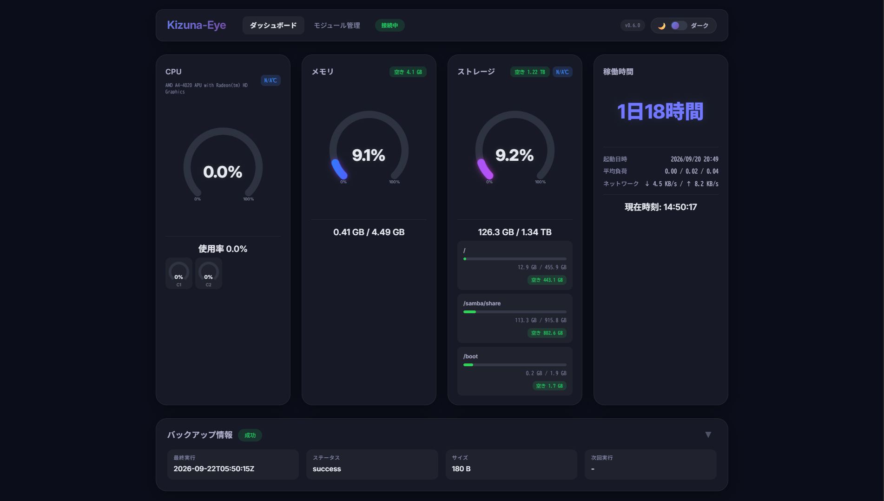
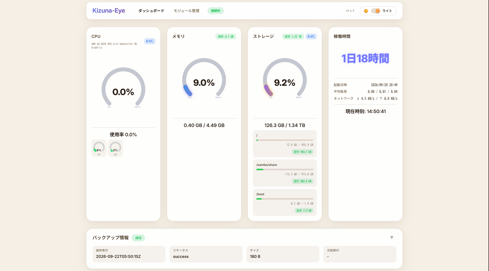
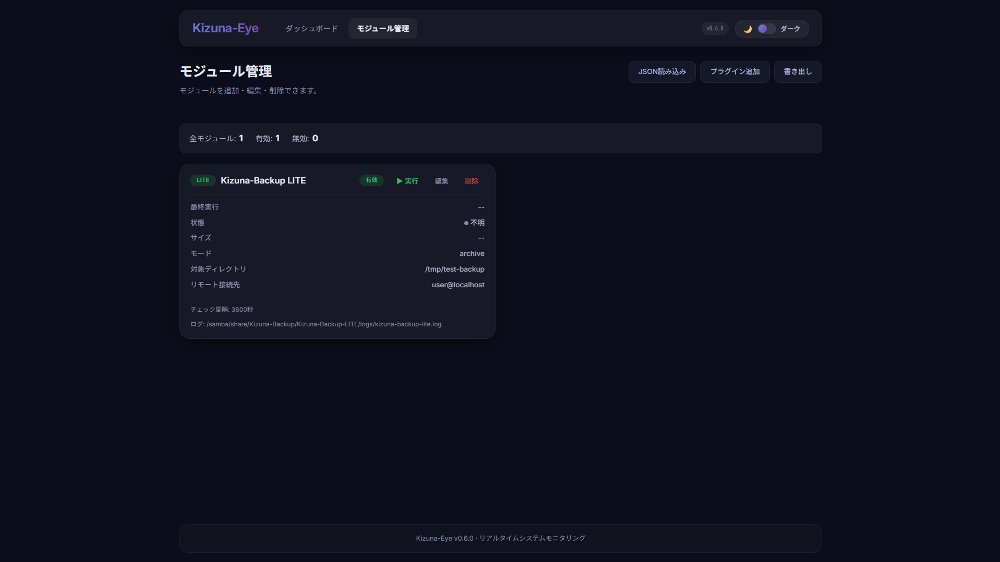
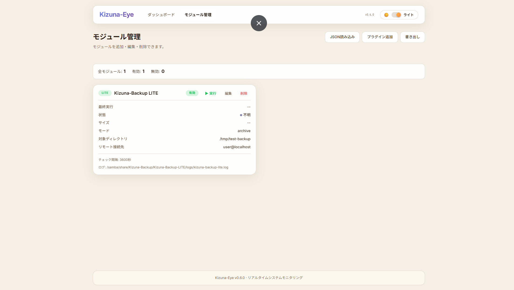

# `README.ja.md` 完全版（JA）

```markdown
# Kizuna-Eye

Go製の軽量サーバー監視ツール。低スペックマシン向けに設計されています。

[English](README.md) | **日本語**

**Kizuna-Eye** は、低スペックサーバー向けに設計された、Go製の軽量サーバー監視ツールです。ダッシュボードとエージェントの合計メモリ使用量は **約30〜50MB** で、Raspberry Piや古いPCでも快適に動作します。

## 特徴

- **軽量**: ダッシュボード + エージェントで約30〜50MB
- **リアルタイム更新**: WebSocket経由で1秒以内に反映
- **ブラウザベース設定**: SSH不要で全設定が完結
- **プラグイン機構**: Goの `.so` ダイナミックプラグインで機能拡張
- **SNS通知**: Discord / Telegram / LINE への通知に対応
- **ダーク/ライトモード**: 環境に合わせて切替可能
- **プロセス一覧**: CPU / メモリ順ソート
- **ネットワーク速度**: リアルタイム表示
- **ディスクS.M.A.R.T**: *予定*

> *Kizuna-Eye は Go の `plugin` パッケージでビルドされた `.so` モジュールを追加することで機能拡張が可能です。プラグインは独自のステータス報告、スケジュールタスクの登録、モジュール管理 UI への表示を行えます。*

## スクリーンショット

<p align="center">
  
  <br>
  <em>リアルタイムシステム監視ダッシュボード（ダークモード）</em>
</p>

### テーマ切り替え

| ダッシュボード（ダーク） | ダッシュボード（ライト） |
| :---: | :---: |
|  |  |

### モジュール管理

| モジュール管理（ダーク） | モジュール管理（ライト） |
| :---: | :---: |
|  |  |

## アーキテクチャ

Kizuna-Eye は2つの主要コンポーネントで構成されています。

- **Agent**: 監視対象サーバーでシステムメトリクスを収集し、プラグインを実行します。
- **Dashboard**: Agent から WebSocket 経由でメトリクスを受信し、Web UI を提供し、通知を送信します。

Agent と Dashboard は WebSocket で通信します。プラグインは Agent によって `.so` 共有オブジェクトとしてロードされます。プラグインがステータスを報告すると、Agent がそれを集約して Dashboard に転送します。

## 動作要件

- **Go 1.27.1** 以上
- **Ubuntu Server** 20.04 以上（他のLinuxディストリビューションでも動作可）
- **CGO_ENABLED=1**（`plugin` パッケージ使用時）
- **smartctl**（任意、S.M.A.R.T監視使用時）*（予定）*

## インストール

### 1. リポジトリをクローン

```bash
git clone https://github.com/sy815twty-spec/Kizuna-Eye.git
cd Kizuna-Eye
2. 依存関係を取得
bash
go mod download
3. ビルド
bash
./build.sh
build.sh は以下のバイナリを /opt/kizuna-eye/bin/ に配置します。

agent_linux

dashboard_linux

plugin-inspect

4. 設定ファイルを準備
bash
cp dashboard_config.example.json dashboard_config.json
cp agent_config.example.json agent_config.json
cp modules.json.example modules.json
各ファイルを環境に合わせて編集してください。

5. 起動
bash
./start.sh
ブラウザで http://<server-ip>:8080 を開いてください。

設定
dashboard_config.json
json
{
    "listen_addr": ":8080",
    "log_file": "dashboard.log",
    "static_dir": "./web/static",
    "plugins_dir": "/opt/kizuna-eye/bin/plugins",
    "notifications": {
        "enabled": true,
        "agent_timeout_sec": 30,
        "hold_sec": 5,
        "cooldown_sec": 300,
        "memory_warn_pct": 70,
        "memory_critical_pct": 85,
        "disk_free_warn_pct": 20,
        "disk_free_critical_pct": 10,
        "cpu_temp_warn_c": 70,
        "cpu_temp_critical_c": 85,
        "notify_recovery": true,
        "channels": [
            {
                "type": "discord",
                "enabled": true,
                "webhook_url": "https://discord.com/api/webhooks/YOUR_WEBHOOK_ID/YOUR_WEBHOOK_TOKEN"
            }
        ]
    }
}
agent_config.json
json
{
    "dashboard_url": "ws://localhost:8080/ws",
    "interval": 1.0,
    "log_file": "logs/agent.log",
    "disk_path": "/"
}
modules.json
プラグインは modules.json に登録します。各エントリはプラグイン名、タイプ、設定を指定します。

json
[
  {
    "name": "example_plugin",
    "type": "plugin",
    "enabled": true,
    "config": {
      "plugin_path": "/opt/kizuna-eye/bin/plugins/example_plugin.so",
      "custom_option": "value"
    }
  }
]
plugin_path は必須フィールドです。その他のフィールドは、プラグインの Configure() メソッドに渡されます。

プラグイン開発
Kizuna-Eye のプラグインは、Go標準の plugin パッケージを使って .so 共有オブジェクトとしてビルドします。

必要なインターフェース
go
type Module interface {
    Name() string
    Description() string
    Interval() time.Duration
    Run(ctx context.Context) error
    Init(ctx context.Context) error
}

type ConfigProvider interface {
    GetConfigFields() []ConfigField
}

type DisplayNameProvider interface {
    DisplayName() string
}
プラグインのビルド
bash
CGO_ENABLED=1 go build -buildmode=plugin -o my_plugin.so .
プラグインのアップロード
Webダッシュボードの「モジュール管理」タブから .so ファイルをアップロードしてください。組み込みの plugin-inspect ツールが自動的にプラグインを解析し、設定可能なフィールドを検査して、動的設定フォームを構築します。

任意: 表示名
DisplayName() を実装すると、UIのバッジにフレンドリーな名前を表示できます。

go
func (p *MyPlugin) DisplayName() string {
    return "My Custom Plugin"
}
未実装の場合、UIはプラグイン名にフォールバックします。

プラグインの例
Kizuna-Backup LITE: アーカイブ/同期モード、SSH経由のrsync転送、SHA-256検証を備えたバックアッププラグイン。（別プロジェクト）

ライセンス
MIT License. 詳細は LICENSE を参照してください。

作者
sy815twty-spec（Exi Server Team）

GitHub: https://github.com/sy815twty-spec

Website: https://exi-server.site/

謝辞
gopsutil - システム情報収集

gorilla/websocket - WebSocket通信