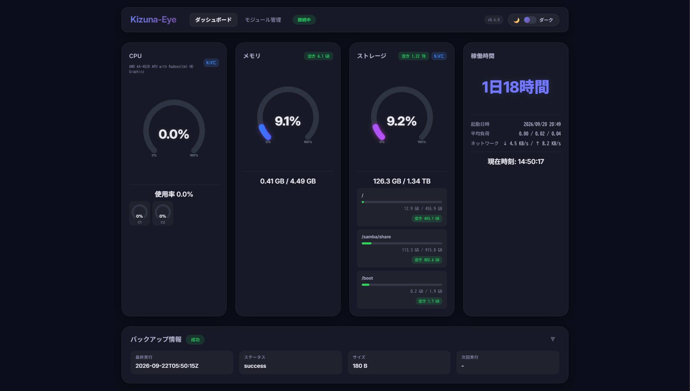
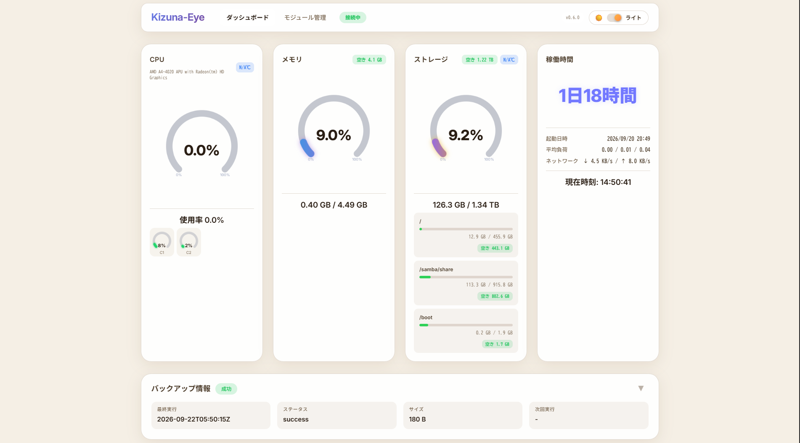
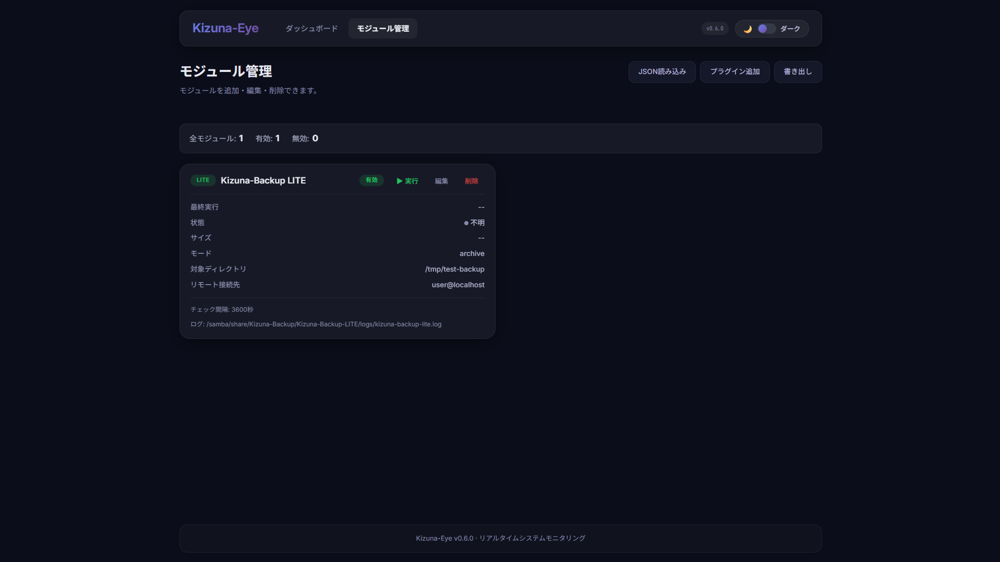
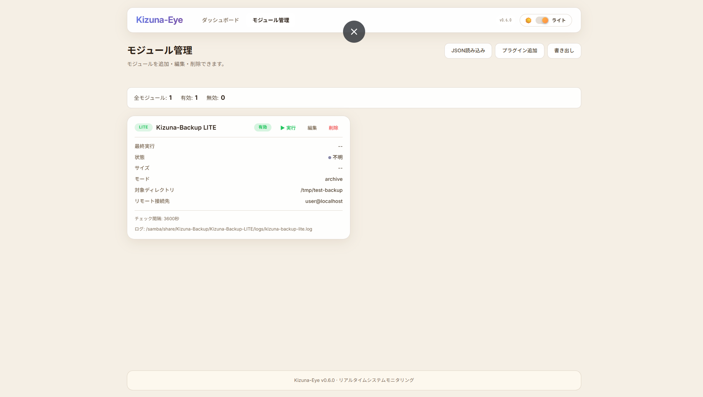

# Kizuna-Eye

Go製の軽量サーバー監視ツール。低スペックマシン向けに設計されています。

[English](README.md) | **日本語**

**Kizuna-Eye** は、低スペックサーバー向けに設計された、Go製の軽量サーバー監視ツールです。ダッシュボードとエージェントの合計メモリ使用量は **約30〜50MB** で、Raspberry Pi や古いPCでも快適に動作します。

## 特徴

- **軽量**: ダッシュボード + エージェントで約30〜50MB
- **リアルタイム更新**: WebSocket経由で1秒以内に反映
- **ブラウザベース設定**: SSH不要で全設定が完結
- **認証（任意）**: ロール（admin / operator / viewer）、bcrypt パスワード、セッション Cookie、IP単位のログイン試行制限
- **プラグイン機構**: Goの `.so` ダイナミックプラグインで機能拡張
- **通知**: Discord / Slack / Telegram / LINE / Email（SMTP）
- **ダーク / ライトモード**: OS設定にも追従
- **プロセス一覧**: CPU / メモリ順ソート
- **ディスク S.M.A.R.T**: ディスクの健康状態と温度（`smartctl` 使用時、任意）
- **ネットワーク速度**: リアルタイム表示
- **メトリクス履歴**: CPU / メモリ / ディスクの推移グラフ（直近約1時間）
- **アラート履歴の永続化**: 再起動後も履歴が残り、UIから閲覧・クリア可能
- **アラート閾値の動的変更**: UI から再起動なしで変更可能
- **Prometheus メトリクス**: `GET /api/metrics`
- **ログローテーション**: サイズベースで自動ローテーション
- **i18n**: 日本語 / 英語 UI
- **軽量・自己完結**: 外部依存なし。信頼できるネットワーク / VPN 内での利用を想定

## スクリーンショット

  
   
  <em>リアルタイムシステム監視ダッシュボード（ダークモード）</em>

### テーマ切り替え

| ダッシュボード（ダーク） | ダッシュボード（ライト） |
| :---: | :---: |
|  |  |

### モジュール管理

| モジュール管理（ダーク） | モジュール管理（ライト） |
| :---: | :---: |
|  |  |

## アーキテクチャ

Kizuna-Eye は2つの主要コンポーネントで構成されています。

- **Agent**: 監視対象サーバーでシステムメトリクスを収集し、プラグインを実行します。
- **Dashboard**: Agent から WebSocket 経由でメトリクスを受信し、Web UI を提供し、通知を送信します。

Agent と Dashboard は WebSocket で通信します。プラグインは Agent によって `.so` 共有オブジェクトとしてロードされます。プラグインがステータスやセキュリティイベントを報告すると、Agent がそれを集約して Dashboard に転送します。

## 動作要件

- **Go 1.27.1** 以上
- **Ubuntu Server** 20.04 以上（他のLinuxディストリビューションでも動作可）
- **CGO_ENABLED=1**（`plugin` パッケージ使用時）
- **rsync**（SSHファイル転送使用時）
- **smartctl**（任意、S.M.A.R.T監視使用時）

## セキュリティ上の注意

Kizuna-Eye は信頼できるネットワーク / VPN 内での利用を想定しています。以下の設定は**実質的なリモートコード実行（RCE）**につながるため、特に注意してください。

- **`plugins_upload_enabled: true` と `auth.enabled: false` を同時に使わないでください。** この組み合わせでは、ネットワーク上の誰でも `.so` プラグインをアップロードして実行でき、サーバーを乗っ取られます。プラグインのアップロードを使う場合は必ず認証を有効にしてください（起動時にも警告ログを出力します）。
- **設定ファイルには秘密情報が含まれます。** `dashboard_config.json`（`agent_token` / `webhook_url`）と `agent_config.json`（`token`）はリポジトリにコミットせず、権限を 0600 に保ってください（`.gitignore` 済み）。
- **`/api/config` は秘密情報をマスクして返します。** マスク値（`***`）をそのまま保存しても既存の秘密は保持されますが、`users.json` と同様に取り扱いには注意してください。
- **プラグイン `.so` は信頼できるものだけを配置してください。** Go プラグインはサーバー本体と同じ権限で動作します。
- **通知本文は外部入力由来の値を含みます。** 各チャンネルでエスケープとメンション無効化を行っています。

## プラグイン再ビルドの運用注意（重要）

Go の `plugin` パッケージは、プラグインと本体が**共有パッケージのハッシュまで完全一致**していることを要求します。したがって、次のいずれかを変更した場合は、**Agent 本体と全プラグイン（`.so`）を同一ソースから同時に再ビルド**してください。片方だけ再ビルドすると `plugin was built with a different version of package ...` で読み込みに失敗します。

- `pkg/module`（プラグインの共通型・インターフェース。`Module` / `ConfigField` / `SecurityEvent` など）
- `pkg/status`（`SystemStatus` などの共有型）

手順: (1) `./build.sh` で本体を再ビルド。(2) 各プラグインを同一ソースで再ビルド（例: `cd /path/to/Kizuna-Security/plugin && GOWORK=off CGO_ENABLED=1 go build -buildmode=plugin -o kizuna_security.so .`）。(3) 生成した `.so` を `plugins/` へ配備し、agent を再起動。

## インストール

### 1. リポジトリをクローン

    git clone https://github.com/sy815twty-spec/Kizuna-Eye.git
    cd Kizuna-Eye

### 2. 依存関係を取得

    go mod download

### 3. ビルド

    ./build.sh

`build.sh` は以下のバイナリを `/opt/kizuna-eye/bin/` に配置します。

- `agent_linux`
- `dashboard_linux`
- `plugin-inspect`

### 4. 設定ファイルを準備

    cp dashboard_config.example.json dashboard_config.json
    cp agent_config.example.json agent_config.json
    cp modules.json.example modules.json

各ファイルを環境に合わせて編集してください。全項目は `*.example.json` に記載されています。最小構成は以下のとおりです。

`dashboard_config.json`:

    {
        "listen_addr": ":8080",
        "log_file": "dashboard.log",
        "static_dir": "./web/static",
        "plugins_dir": "/opt/kizuna-eye/bin/plugins",
        "plugins_upload_enabled": false,
        "alert_history_file": "logs/alert_history.jsonl",
        "auth": {
            "enabled": false,
            "secure_cookies": false,
            "session_ttl_hours": 12,
            "users_file": "users.json",
            "agent_token": "CHANGE_ME_TO_A_LONG_RANDOM_STRING"
        },
        "notifications": {
            "enabled": true,
            "agent_timeout_sec": 30,
            "hold_sec": 5,
            "cooldown_sec": 300,
            "recovery_hold_sec": 30,
            "memory_warn_pct": 70,
            "memory_critical_pct": 85,
            "disk_free_warn_pct": 20,
            "disk_free_critical_pct": 10,
            "cpu_temp_warn_c": 70,
            "cpu_temp_critical_c": 85,
            "notify_recovery": true,
            "channels": [
                {
                    "type": "discord",
                    "enabled": true,
                    "webhook_url": "https://discord.com/api/webhooks/YOUR_WEBHOOK_ID/YOUR_WEBHOOK_TOKEN"
                }
            ]
        }
    }

`agent_config.json`:

    {
        "dashboard_url": "ws://localhost:8080/ws",
        "interval": 1.0,
        "log_file": "logs/agent.log",
        "disk_path": "/",
        "token": "CHANGE_ME_TO_A_LONG_RANDOM_STRING"
    }

`modules.json`:

    [
      {
        "name": "example_plugin",
        "type": "plugin",
        "enabled": true,
        "config": {
          "plugin_path": "/opt/kizuna-eye/bin/plugins/example_plugin.so"
        }
      }
    ]

### 5. 起動

    ./start.sh

ブラウザで `http://<server-ip>:8080` を開いてください。

## 認証（任意）

Kizuna-Eye は認証あり・なしの両方で動作します。認証は**既定で無効**です。有効にするには `dashboard_config.json` の `auth` ブロックで `enabled: true` を設定します（`secure_cookies` / `session_ttl_hours` / `agent_token` も指定可能）。

有効にすると、初回アクセス時に `/setup.html` へリダイレクトされ、最初のユーザーを作成します。**最初に作成したユーザーが管理者になります。**

### ロール

| ロール | アクセス範囲 |
|---|---|
| viewer | ダッシュボード・ログ（閲覧のみ） |
| operator | ＋ モジュール管理・手動バックアップ実行・アラート閾値変更 |
| admin | 全権（設定エディタ・プラグインアップロード・ユーザー管理） |

管理者はヘッダーの「ユーザー」から追加・削除できます。パスワードは `users.json` に **bcrypt ハッシュ**で保存され、最後の管理者は削除・降格できません。

### Agent トークン

`dashboard_config.json` の `auth.agent_token` と `agent_config.json` の `token` に同じ値を設定します。Agent は WebSocket 接続時に認証するため、ブラウザが Agent を偽装できなくなります。トークンが空の場合は従来のヒューリスティック判定になります。

### HTTPS

ログイン情報を平文 HTTP で流してはいけません。TLS 終端するリバースプロキシの背後で動かしてください。

- ダッシュボードを localhost にバインド（`listen_addr` を `127.0.0.1:8080` に）
- Caddy や nginx で TLS 終端し、`127.0.0.1:8080` へプロキシ
- `secure_cookies` を `true` に設定（Cookie が HTTPS 時のみ送信される）

## 通知

`notifications.channels` は `discord` / `slack` / `telegram` / `line` / `email` に対応しています。各タイプに必要な項目は `dashboard_config.example.json` を参照してください。アラート閾値は設定エディタ（admin）から再起動なしで変更できます。

## プラグイン開発

Kizuna-Eye のプラグインは、Go標準の `plugin` パッケージを使って `.so` 共有オブジェクトとしてビルドします。

必要なインターフェース:

    type Module interface {
        Name() string
        Description() string
        Interval() time.Duration
        Run(ctx context.Context) error
        Init(ctx context.Context) error
    }

    type ConfigProvider interface {
        GetConfigFields() []ConfigField
    }

    type DisplayNameProvider interface {
        DisplayName() string
    }

ビルド:

    CGO_ENABLED=1 go build -buildmode=plugin -o my_plugin.so .

Webダッシュボードの「モジュール管理」タブから `.so` をアップロードしてください。組み込みの `plugin-inspect` ツールがプラグインを解析し、設定可能なフィールドを検査して、動的設定フォームを構築します。

任意で `DisplayName()` を実装すると、UIのバッジにフレンドリーな名前を表示できます。未実装の場合はプラグイン名にフォールバックします。

### プラグインの例

Kizuna-Backup LITE: アーカイブ / 同期モード、SSH経由のrsync転送、SHA-256検証を備えたバックアッププラグイン（別プロジェクト）。

## テスト

    go test ./...

gcc のある Linux ホストでは:

    CGO_ENABLED=1 go test -race ./...

静的解析（リリース前推奨）:

    go vet ./...
    staticcheck ./...
    govulncheck ./...

## ライセンス

MIT License. 詳細は [LICENSE](LICENSE) を参照してください。

## 作者

sy815twty-spec（Exi Server Team）

- GitHub: https://github.com/sy815twty-spec
- Website: https://exi-server.site/

## 謝辞

- [gopsutil](https://github.com/shirou/gopsutil) - システム情報収集
- [gorilla/websocket](https://github.com/gorilla/websocket) - WebSocket通信
